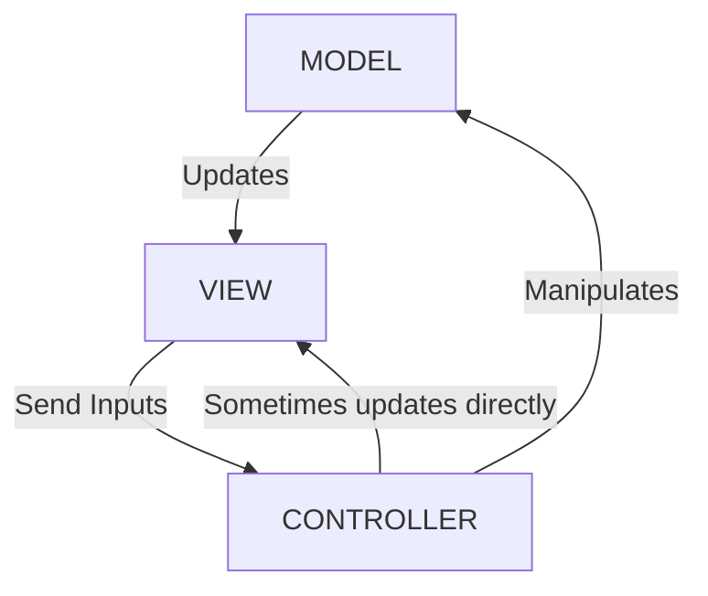
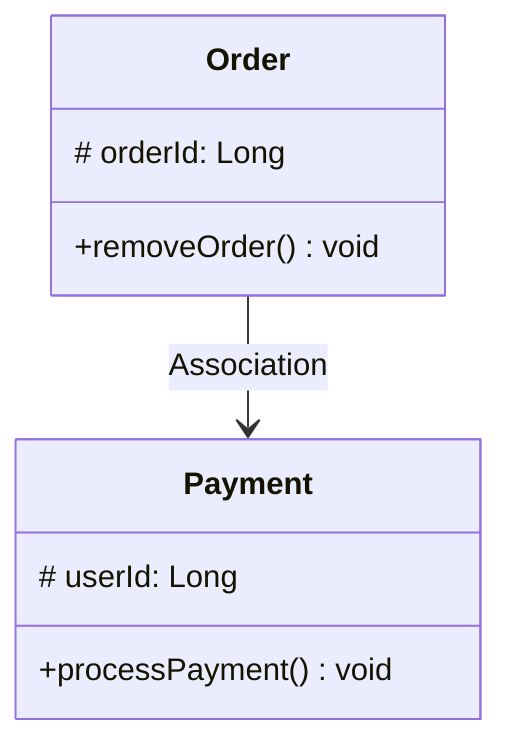

+++
title = 'Principios de Arquitectura de Software: Entendiendo la Cohesion y el SoC'
date = '2026-03-31T11:58:00-06:00'
draft = false

# ================================
# SEO y Metadatos
# ================================
description = "Una explicación detallada sobre cómo mantener los módulos de software cohesivos y la importancia de la Separación de Preocupaciones (SoC) en Java."
summary = "Aprende qué es la Cohesion en el desarrollo de software, por qué es crucial, y cómo el principio SoC te ayuda a construir componentes más robustos."
cover = "/images/cohesion-cover.png" # Imagen portada para OpenGraph (Facebook, Twitter, LinkedIn)
author = "Cyb3rh4ck" 
type = "post"

# ================================
# Taxonomías
# ================================
tags = ["Java", "Programación Orientada a Objetos", "Design Patterns", "Backend", "Arquitectura De Software", "Cohesion", "Separation of Concerns"]
categories = ["Desarrollo", "Java", "Arquitectura"]
keywords = ["Cohesión", "Cohesion", "Separation of Concerns", "SoC", "Arquitectura", "Java"]

+++

<!-- Escribe aquí el "hook" o primera línea que captará la atención del lector -->
¿Por qué a veces es tan difícil reutilizar o entender una sola clase en tu proyecto sin tener que descifrar miles de líneas de código? La clave está en la ***Cohesion***.

## 🚀 Manteniendo los Módulos Cohesivos

La *cohesion* (cohesión) en el desarrollo de software se refiere a qué tan estrechamente relacionadas y enfocadas están las responsabilidades de un solo módulo, clase o función. 

Cuando los componentes de un módulo están estrechamente vinculados, el código resulta ser mucho más fácil de mantener, entender y reutilizar. Una alta *cohesion* es una medida de qué tan bien trabajan en conjunto los elementos internos del módulo para lograr un único propósito bien definido. Cuanto mayor es la *cohesion*, mucho mejor, ya que esto típicamente conduce a un software más robusto y confiable.

Por ejemplo, consideremos una aplicación hipotética que requiere la administración de información de usuarios. Una clase enfocada exclusivamente en administrar esta información tendría una alta *cohesion* si solo contuviera métodos relacionados directa y fuertemente con dicho propósito (como agregar, actualizar y eliminar usuarios). 

Echa un vistazo a la siguiente clase `UserManager`:

```java
public class UserManager {
  public void addUser(User user) {
      // lógica para agregar usuario...
  }
  public void updateUser(User user) {
      // lógica para actualizar usuario...
  }
}
```

La clase `UserManager` muestra una **alta *cohesion*** debido a que todos sus métodos y propiedades están directamente vinculados con una única responsabilidad: gestionar la información de los usuarios.

Por otro lado, tendríamos una **baja *cohesion*** si esta misma clase incluyera erróneamente métodos para validar o enviar correos electrónicos (`validateEmail` y `sendEmail`). Éstos últimos deberían residir en una clase totalmente independiente, como por ejemplo una clase designada para ello llamada `Email`:

```java
public class UserManager {
  public void addUser(User user) { ... }
  public void updateUser(User user) { ... }

  // ❌ Esto genera baja cohesion:
  public void validateEmail(String email) { ... }
  public void sendEmail() { ... }
}
```

Mantener una alta *cohesion* en nuestros módulos facilitará inmensamente el futuro mantenimiento y la pura comprensión de nuestro proyecto de la mano con cada refactor.

## 💡 Separation of Concerns (SoC)

El concepto central del principio de *Separation of Concerns* o **SoC** (Separación de Preocupaciones) implica dividir la aplicación de software en secciones distintas, donde cada sección se enfoca en un interés o *concern* particular, minimizando al máximo la superposición con otras partes o secciones. Este principio se aplica a varios niveles del desarrollo de software, tales como el nivel arquitectónico y el nivel de programación lógica.

* **A nivel arquitectónico**, el SoC separaría la aplicación en distintas capas, como por ejemplo al utilizar el patrón de diseño del Modelo-Vista-Controlador (*Model-View-Controller* o MVC). 
* **A nivel de programación**, este principio dividirá los componentes, servicios, funciones o módulos en dominios bien definidos, asegurando que cada parte del programa aborde exclusiva y lógicamente un solo aspecto específico de la funcionalidad global de la aplicación.

### Arquitectura a Nivel MVC



### Separación a Nivel de Clases



> *(Tal como se demuestra gráficamente), en la literatura técnica base la **Figura 1.2** ilustraba tradicionalmente el *Separation of Concerns* tanto a nivel arquitectónico como a nivel de código de una manera simple. A modo de arquitectura, se presenta el patrón MVC separando base de datos de interfaces; mientras que a nivel de clases, veríamos a un entorno con clases independientes como `Payment` y `Order` manejando firmemente sus respectivas responsabilidades por sí solas.*

Una ruptura grave de este principio de arquitectura ocurriría si decidiéramos ignorar los límites del domino; si por citar un caso, incluyéramos arbitrariamente dentro de la clase de cobros `Payment` un método responsable de eliminar pedidos de stock, como por ejemplo un hipotético `removeOrder()`. 

## 🎓 Conclusión

Una *Cohesion* alta y el firme respeto al principio de *Separation of Concerns* representan las herramientas y criterios más fundamentales de todo arquitecto para evitar el temido "código espagueti". Separar lógicamente las responsabilidades nos garantiza construir software fácil de leer y robusto. ¡Comienza a aplicarlo activamente en las estructuras de tus clases del entorno Java hoy mismo!
