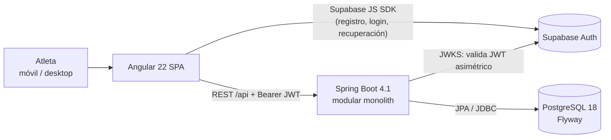
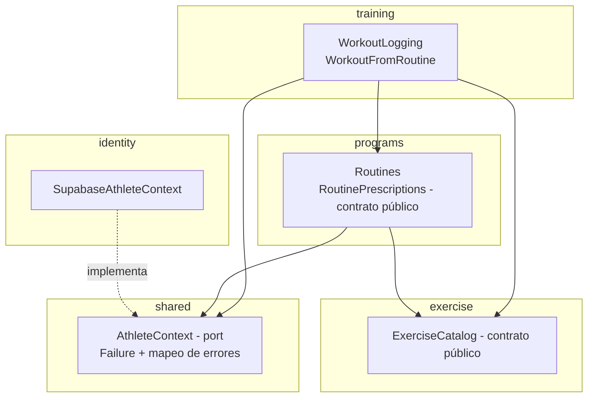
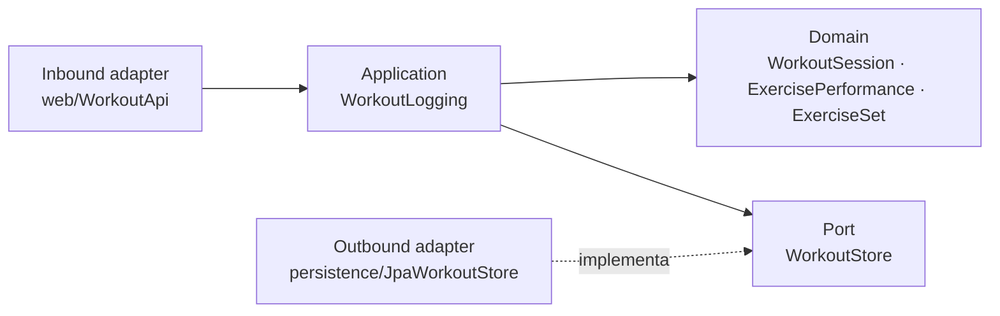
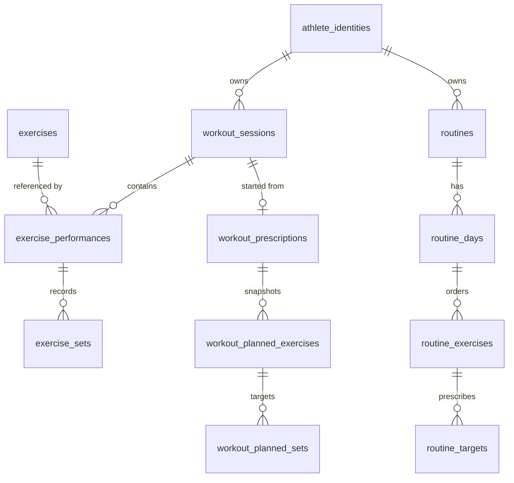
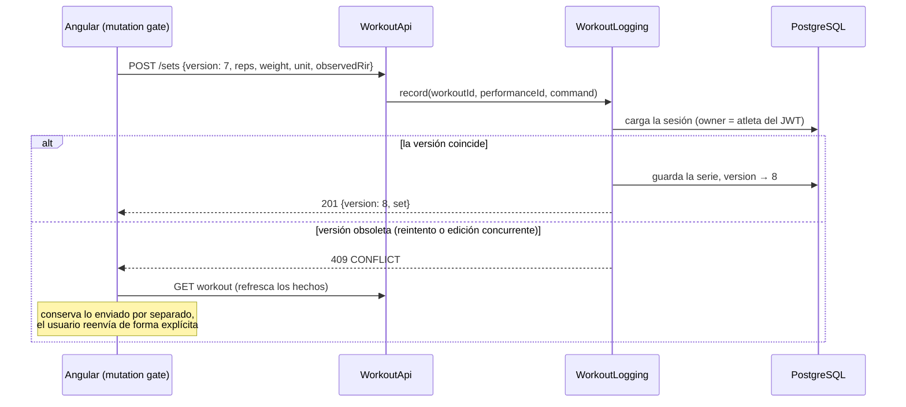

+++
title = 'PhysiqueOS: Case Study de Arquitectura de un Modular Monolith'
date = '2026-10-03T09:00:00-06:00'
draft = false
pin = true

# ================================
# SEO y Metadatos
# ================================
description = "Case study de PhysiqueOS: app de entrenamiento con Java 25, Spring Boot 4.1, PostgreSQL y Angular 22, diseñada como modular monolith con DDD y arquitectura hexagonal."
summary = "Cómo diseñé PhysiqueOS, una app para registrar entrenamientos de fuerza: modular monolith, límites por módulo de negocio, concurrencia optimista, snapshots inmutables y una estrategia de pruebas con PostgreSQL real."
cover = "/images/physiqueos-cover.png" # Imagen portada para OpenGraph (Facebook, Twitter, LinkedIn)
keywords = ["PhysiqueOS", "Modular Monolith", "Hexagonal Architecture", "DDD", "Spring Boot", "Angular", "PostgreSQL", "Case Study"]
author = "Cyb3rh4ck"
type = "post"

# ================================
# Taxonomías
# ================================
tags = ["Arquitectura De Software", "Modular Monolith", "Spring Boot", "Angular", "DDD", "Proyectos"]
categories = ["Arquitectura", "Proyectos"]

+++

**PhysiqueOS** es mi app para registrar entrenamientos de fuerza. La empecé como proyecto de portafolio, pero la construyo con criterios de producto real: la uso desde mi celular en el gimnasio y cada decisión técnica queda documentada. En este *case study* explico **qué hace, cómo está construida y por qué tomé cada decisión de arquitectura**.

> **Stack:** Java 25 · Spring Boot 4.1 · PostgreSQL 18 · Flyway · Angular 22 · Supabase Auth · Testcontainers · Playwright · GitHub Actions
>
> **Estado:** MVP funcional, validado en smartphone. El *hosting* de producción está diferido de forma intencional.

## 🚀 El problema

La mayoría de las apps de gimnasio son lentas de usar entre series, o mezclan *lo planeado* con *lo que realmente pasó*. PhysiqueOS se basa en tres principios de producto:

1. **Registro rápido y confiable.** Capturar una serie en segundos desde el teléfono, sin perder datos si la red falla.
2. **Separar hechos de prescripciones.** El objetivo de una rutina ("8–10 reps, RIR 2") nunca se convierte por sí solo en una serie registrada.
3. **Privacidad e integridad por diseño.** Cada registro pertenece a un solo atleta, y el servidor lo valida en cada *request*.

## 💡 Funcionalidades entregadas

| Área | Capacidad |
| --- | --- |
| **Acceso** | Registro, confirmación por correo, login/logout, recuperación y cambio de contraseña con Supabase Auth. Cada cuenta corresponde a un atleta privado. |
| **Registro de workouts** | Iniciar un workout libre, buscar ejercicios en un catálogo compartido, ver el rendimiento anterior, registrar/corregir/eliminar series (reps, peso + unidad, RIR observado opcional 0–10) y finalizar con revisión explícita. Un workout completado es **inmutable**. |
| **Edición multi-ejercicio** | Varias tarjetas de ejercicio abiertas a la vez, con todas las escrituras serializadas y consistentes. |
| **Conversión de unidades** | Conversión explícita KG ⇄ LB. El peso viaja como decimal en *string*, nunca como *float*. |
| **Mis entrenamientos** | Historial paginado y filtrable. Retomar sesiones en progreso y consultar las completadas en modo lectura. |
| **Rutinas** | Rutinas privadas de varios días con ejercicios ordenados y objetivos por serie (reps, rango de RIR, descanso). Edición versionada y archivado. Al iniciar un día, sus objetivos se copian como *snapshot* al workout. |
| **Cronómetro de descanso** | Uno por workout, manual o con reinicio automático al confirmar una serie nueva. Sobrevive a recargas y al cambio de app en el móvil. |

## 🏗️ Arquitectura general



### ¿Por qué un *modular monolith* y no microservicios?

Un solo despliegue, una sola base de datos y transacciones locales hacen el desarrollo y la operación mucho más simples. Los límites estrictos entre módulos mantienen abierta la opción de extraer servicios, pero **solo cuando exista evidencia** que lo justifique: escalamiento independiente, ritmos de release distintos o necesidades de aislamiento. Sin un requerimiento demostrado no hay *brokers*, cachés distribuidos ni microservicios.

## ⚙️ Diseño del backend

### Módulos y dirección de dependencias

El código se organiza por **módulo de negocio**, no por capa técnica: no hay carpetas globales de `controllers/`, `services/` y `repositories/`.



- Los módulos solo se comunican mediante **contratos públicos pequeños** (`RoutinePrescriptions`, `ExerciseCatalog`). Ninguno lee repositorios, entidades ORM ni tablas de otro.
- El grafo es **acíclico**, y un **test de arquitectura** rompe el *build* si aparece una dependencia prohibida.
- `shared` solo contiene primitivas técnicas estables, nunca conceptos de negocio.

### Capas dentro de un módulo: hexagonal, aplicada con pragmatismo



- **Domain.** El *aggregate* `WorkoutSession` protege los invariantes: solo un workout en progreso acepta cambios, ejercicios y series conservan su orden, y finalizar bloquea el registro. No depende de Spring, HTTP ni ORM.
- **Application.** Orquesta los casos de uso y declara la intención transaccional, incluido el nivel de aislamiento donde importa (`REPEATABLE_READ` en lecturas consistentes).
- **Adapters.** Traducen HTTP y persistencia. Los modelos de persistencia nunca salen del módulo como respuesta de la API.
- **Trade-off consciente:** no hay un par interfaz/implementación por cada clase. Los *ports* existen solo donde aíslan una dependencia externa real: base de datos, proveedor de identidad u otro módulo.

### Modelo de datos



- Cada tabla tiene **un único módulo dueño** (`training`, `programs`, `exercise` o `identity`), y solo ese módulo escribe en ella.
- Las tablas `workout_planned_*` son un **snapshot inmutable** de la rutina al iniciar el día. Editar o archivar la rutina nunca reescribe el historial.
- Las *constraints* de la base respaldan la validación del dominio. Flyway es dueño del esquema y Hibernate solo lo valida. Las migraciones son aditivas, por ejemplo la columna nullable `observed_rir`.

### Consistencia, reintentos y concurrencia

El Wi-Fi del gimnasio no es confiable, así que la API está diseñada para redes inciertas:



- **Optimistic concurrency.** Cada mutación lleva la `version` del workout. Un comando obsoleto se rechaza; nunca se mezcla en silencio.
- **Sin series duplicadas por reintentos.** Un reintento con versión vieja genera conflicto en lugar de un segundo registro.
- **Inicio de rutina idempotente.** Un `requestId` del cliente, recibos por atleta y un *advisory lock* de PostgreSQL garantizan que un reintento devuelva el mismo workout.
- **Contrato de errores estable.** Un solo tipo `Failure` (`VALIDATION`, `NOT_FOUND`, `CONFLICT`, …) se traduce a JSON con código, mensaje seguro y errores por campo. Nunca se devuelven *stack traces*.

### Seguridad

- Spring Security **OAuth2 Resource Server** valida los **JWT asimétricos** de Supabase mediante **JWKS**.
- El módulo `identity` relaciona `issuer + subject` con un UUID interno de atleta. El correo nunca es la llave de pertenencia.
- **El ID del atleta nunca viene del cliente.** Cada lectura y escritura filtra por el dueño autenticado, y un ID adivinado de otro atleta responde `404`. Un test de frontera lo cubre.
- La API es *stateless* y sin cookies: CSRF deshabilitado y sin orígenes CORS externos. Las credenciales solo llegan por variables de entorno.
- Swagger UI existe solo con el perfil `dev` y sirve el `openapi.yaml` empaquetado en el *build*.

## 🖥️ Diseño del frontend

```
src/app
├── auth/              AuthService · authGuard · authInterceptor (Bearer)
├── dashboard/
├── my-workouts/
├── routines/          RoutinesPage · routine-api (adaptador HTTP tipado)
└── workout-logging/
    ├── api/           workout-api.ts · workout-contract.ts (espejo de OpenAPI)
    ├── workout-state.ts   signals + mutation gate único
    ├── set-editor · exercise-catalog · weight-conversion
    └── rest-stopwatch (+ panel)
```

- **Estructura por feature** con componentes *standalone*, *reactive forms* y **signals** con alcance de ruta. No hay librería de estado global mientras ningún requerimiento la justifique.
- **Un mutation gate por workout** serializa las escrituras, aunque haya varias tarjetas abiertas.
- **Comandos inciertos:** si falla la red, lo enviado se guarda aparte de los hechos refrescados del servidor, y reintentar requiere una acción explícita del usuario.
- **UX mobile-first:** teclados numéricos, unidades visibles, foco predecible y *guards* `canDeactivate` para no perder cambios.
- **Almacenamiento mínimo:** los borradores viven en memoria. `sessionStorage` solo guarda la sesión de Supabase y el *checkpoint* del cronómetro. Logout o cambio de cuenta limpian todo el estado privado.

## 🧪 Estrategia de calidad

| Nivel | Herramienta | Qué cubre |
| --- | --- | --- |
| Domain | JUnit | Invariantes y ciclo de vida de `WorkoutSession` |
| Integración | Testcontainers + PostgreSQL real | Casos de uso, *constraints*, migraciones (de vacío a la última), rutinas, RIR, límites y autenticación JWT |
| Seguridad | Tests de integración | Acceso entre atletas responde `404` sin filtrar datos |
| Contrato | `ApiContractTest` | El backend coincide con `openapi.yaml` |
| Arquitectura | Test de dependencias | Límites de módulos y capas |
| Frontend | Vitest + jsdom | Estado, mutation gate, conversión, cronómetro e interceptor |
| End-to-end | Playwright + axe-core | Recorridos autenticados (proveedor de identidad simulado y PostgreSQL desechable) más revisión automática de accesibilidad |
| CI | GitHub Actions | `mvnw verify` · `format:check` · `test` · `build` |

## 🧭 Proceso de ingeniería

- **Vertical slices.** Cada feature entrega UI, caso de uso, persistencia y pruebas juntos; no hay fases de "primero todos los repositorios".
- **Planes de ejecución** por feature, con objetivo, criterios de aceptación, riesgos y la evidencia de verificación que realmente se ejecutó.
- **Architecture Decision Records (ADR)** para los *trade-offs* importantes, por ejemplo las prescripciones como *snapshot* o la recuperación del cronómetro.
- **Definition of Done** que distingue entre *feature completa* y *lista para producción*.
- **Desarrollo asistido por IA con reglas claras.** Los agentes de código trabajan bajo instrucciones explícitas del repositorio (`AGENTS.md`, `CLAUDE.md` y guías por rol) sobre límites, seguridad y honestidad en la verificación.

## 🤔 Trade-offs clave

| Decisión | Elegí | Alternativa | Por qué |
| --- | --- | --- | --- |
| Unidad de despliegue | Modular monolith | Microservicios | Alcance de un solo desarrollador; los límites se imponen en código, no en la red |
| Persistencia por módulo | JPA (training, exercise), JDBC (programs) | Un solo ORM | Escrituras acotadas y SQL explícito donde JPA no aportaba valor |
| Concurrencia | Versión optimista por workout | Last-write-wins / locks | Los reintentos móviles nunca deben duplicar ni sobrescribir en silencio |
| Rutina → workout | Snapshot inmutable | Referencia viva | El historial debe conservar su significado aunque cambie la rutina |
| Identidad | Supabase Auth + ID interno de atleta | Auth propia | Sin manejo de contraseñas propio; el proveedor queda como *adapter* |
| Estado en frontend | Signals + mutation gate | NgRx / store global | Los requerimientos no justificaban esa infraestructura |

## 🎓 Conclusión y siguientes pasos

PhysiqueOS demuestra que un *modular monolith* bien delimitado ofrece la mayoría de los beneficios que se buscan en microservicios (límites claros, módulos entendibles por separado y evolución segura) sin su costo operativo. Los siguientes pasos son *hosting* de producción con observabilidad, *backups* y alertas; modelos de lectura para progresión y analytics; mediciones corporales; nutrición; y sugerencias de *coaching* asistidas por IA, siempre separadas de los hechos que registra el atleta.

¿Tienes preguntas sobre alguna de estas decisiones? Déjalas en los comentarios.
