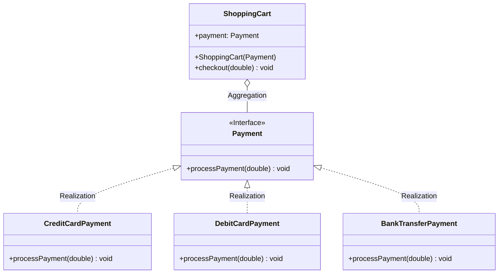

+++
title = 'Principios de Arquitectura de Software: Explorando el Coupling'
date = '2026-03-31T10:30:00-06:00'
draft = false

# ================================
# SEO y Metadatos
# ================================
description = "Una explicación detallada sobre los principios de arquitectura de software, enfocándose en la importancia de un bajo coupling (acoplamiento) en Java."
summary = "Aprende qué es el coupling, por qué es crucial mantenerlo bajo y cómo implementarlo utilizando interfaces en Java para mejorar el diseño de tu sistema."
cover = "/images/coupling-cover.png" # Imagen portada para OpenGraph (Facebook, Twitter, LinkedIn)
author = "Cyb3rh4ck" 
type = "post"

# ================================
# Taxonomías
# ================================
# Etiquetas de Java pre-configuradas para indexar correctamente los temas
tags = ["Java", "Programación Orientada a Objetos", "Design Patterns", "Backend", "Arquitectura De Software", "Coupling", "Cohesion"]
categories = ["Desarrollo", "Java", "Arquitectura"]

+++

<!-- Escribe aquí el "hook" o primera línea que captará la atención del lector -->
¿Por qué el código de tu aplicación a veces es tan frágil que al cambiar algo mínimo, otras partes fallan estrepitosamente? La respuesta a menudo reside en el ***coupling*** (acoplamiento).

## 🚀 Introducción

En este post vamos a profundizar en los principios fundacionales de la arquitectura de software. En el panorama en constante evolución del desarrollo, los arquitectos y desarrolladores son desafiados continuamente a diseñar sistemas que no solo sean funcionales y tengan un alto rendimiento (*performant*), sino que también sean mantenibles, escalables y resilientes al cambio. La clave para lograr este equilibrio reside en adherirse a los principios fundamentales que han sido destilados de décadas de experiencia colectiva y sabiduría en la ingeniería de software. Estos principios son la base sobre la que se construyen sistemas fiables y eficientes.

## 💡 Conceptos Clave

### Explorando el *Coupling* y la *Cohesion*

El *coupling* frecuentemente se compara con la *cohesion* (cohesión). Típicamente, un bajo *coupling* se asocia con una alta *cohesion*, y lo inverso también es cierto. Larry Constantine introdujo las métricas de calidad de software de *coupling* y *cohesion* a finales de la década de 1960 dentro del marco del diseño estructurado, enfatizando las "buenas" prácticas de programación dirigidas a minimizar los costos relacionados con el mantenimiento y las modificaciones.

### Dominando el *Coupling*

El *coupling* denota el nivel de interdependencia entre módulos, paquetes y componentes. Cuando hay un bajo *coupling*, generalmente es señal de un sistema informático bien estructurado y con un buen diseño. Esto proporciona al sistema una mejor mantenibilidad y escalabilidad. Sin embargo, cuando hay un alto *coupling*, los módulos son altamente dependientes entre sí. Esto significa que si haces un cambio en un módulo, también tendrás que hacer cambios en el otro módulo interdependiente.

## 💻 Implementación en Java

A continuación te presento algunos ejemplos de cómo codificarlo en Java:

### Alto *Coupling*

Aquí se presenta código típico que está altamente acoplado:

```java
public class ShoppingCart {

  private CreditCardPayment cc = new CreditCardPayment();
  private DebitCardPayment debit = new DebitCardPayment();

  public void checkout(String typePayment, double amount) {
    if (typePayment.equals("CC")) {
      cc.processCreditCardPayment(amount);
    } else {
      debit.processDebitCardPayment(amount);
    }
  }
}
```

La clase `ShoppingCart` crea instancias de las clases `CreditCardPayment` y `DebitCardPayment` utilizando directamente la palabra clave `new`. Este enfoque presenta problemas en cuanto a futuras actualizaciones y mantenimiento. Si cambiamos las firmas de los métodos (*method signatures*) de esas clases o añadimos nuevos métodos de pago, tendremos que modificar la clase `ShoppingCart` debido a la estrecha vinculación y al alto *coupling* entre ellas. Para añadir nuevas opciones de pago, siempre debemos instanciar una nueva clase e incluir una nueva condición de pago como `if(typePayment.equals("new_payment"))`.

### Bajo *Coupling*

Ahora trabajemos en el mismo ejemplo anterior pero implementaremos un bajo *coupling*. Un bajo *coupling* a menudo se logra mediante el uso de interfaces o clases abstractas, las cuales sirven como contratos entre diferentes partes de un programa y luego sencillamente las pasamos a la clase que las necesita a través del método constructor (*constructor method*).

Primero, creamos la interfaz `Payment`, que contiene el método abstracto `processPayment` y recibe un parámetro de tipo `double`:

```java
public interface Payment {
  void processPayment(double amount);
}
```

Luego, cambiamos las clases `CreditCardPayment` y `DebitCardPayment` para que implementen la interfaz `Payment`, tal como se observa en el código con `implements Payment`:

```java
public class CreditCardPayment implements Payment {
  @Override
  public void processPayment(double amount) {
      //... lógica del pago con tarjeta de crédito
  }
}

public class DebitCardPayment implements Payment {
  @Override
  public void processPayment(double amount) {
      //... lógica del pago con tarjeta de débito
  }
}
```

En la clase `ShoppingCart` declaramos una variable `private` y `final` de tipo `Payment` a nivel de clase y creamos un método constructor `ShoppingCart(Payment payment)` que recibirá la instancia adecuada. La clase que utilice la clase `ShoppingCart` proveerá esta instancia a través del constructor. Finalmente, en el método `checkout` hemos eliminado el parámetro `typePayment`; ya no lo necesitamos, ya que cada tipo de pago implementa el método `processPayment`:

```java
public class ShoppingCart {
  private final Payment payment;

  public ShoppingCart(Payment payment) {
    this.payment = payment;
  }

  public void checkout(double amount) {
    payment.processPayment(amount);
  }
}
```

## 🤔 ¿Por qué usar este enfoque?

Con este enfoque, logramos un código de bajo *coupling* porque no necesitamos cambiar la clase `ShoppingCart` cuando ocurren cambios dentro de los métodos `processPayment` o en las clases `CreditCardPayment` y `DebitCardPayment`. Si necesitamos añadir una nueva forma de pago, simplemente basta con crear una nueva clase y hacer que implemente la interfaz `Payment`; posteriormente, la clase cliente (*client class*) solo necesita inyectar esta modificación a través del método constructor a la clase `ShoppingCart`.

### Diagrama de Clases de la Solución de Bajo *Coupling*

En la **Figura 1.1**, presentamos el diagrama de clases de la solución de bajo *coupling*.



> *El diagrama de bajo coupling resalta que para añadir una nueva forma de pago solo necesitamos crear una clase que implemente la interfaz `Payment` —en este caso particular, la clase teórica `BankTransferPayment`— y no necesitamos cambiar ningún código en la clase `ShoppingCart`.*

## 🎓 Conclusión

Mantener los principios de bajo *coupling* te permitirá diseñar arquitecturas desacopladas donde las modificaciones en un componente no exijan cambios en cascada sobre otras regiones cruciales. Si sigues el uso de buenas prácticas mediante contratos (interfaces), garantizarás una escalabilidad mucho mayor a mediano y largo plazo. ¡Anímate a aplicar este principio hoy y compártelo o deja tu comentario en redes!
